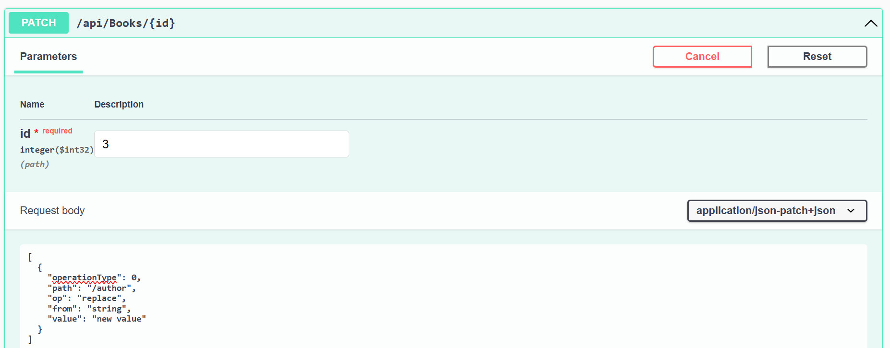
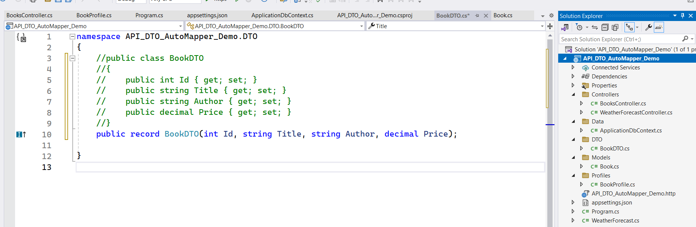

# Example for DTO without AutoMapper

1. Create a new Web API Project (CF_DTO_without_AutoMapper_Demo)
2. Add Models Folder ==> Add Book Class
 ```cs
 public class Book
 {
     public int Id { get; set; }
     public string Title { get; set; }
     public string Author { get; set; }
     public decimal Price { get; set; }
     public DateTime? ReleaseDate { get; set; }
     public string? Genre { get; set; }
 }
    ```
4. Add DTO Folder  - Add BookDTO Class
```cs
    public class BookDTO
    {
        public int Id { get; set; }
        public string Title { get; set; }
        public string Author { get; set; }
        public decimal Price { get; set; }
    }
```

install below packages using Nuget package Manager solution
```cs 
Microsoft.AspNetCore.JsonPatch
Microsoft.AspNetCore.Mvc.NewtonsoftJson
Microsoft.EntityFrameworkCore
Microsoft.EntityFrameworkCore.SqlServer
Microsoft.EntityFrameworkCore.Tools
```
5. Add Data Folder -Add ApplicationDbContext class
```cs
    public class ApplicationDbContext:DbContext
 {
     public ApplicationDbContext(DbContextOptions<ApplicationDbContext> options) : base(options)
     {
     }

     public DbSet<Book> Books { get; set; }
 }
```
# appsetting.json
```json
    ,
  "ConnectionStrings": {
    "DefaultConnection": "Server=(localdb)\\MSSQLLocalDB;Database=Book_DB;Trusted_Connection=True;TrustServerCertificate=true;"
  }

```
# Program.cs
```cs
    builder.Services.AddDbContext<ApplicationDbContext>(options =>
        options.UseSqlServer(builder.Configuration.GetConnectionString("DefaultConnection")));

          builder.Services.AddControllers().AddNewtonsoftJson();
```
Create a folder Name it as Utility (or) Mappings
Add class MappingExtensions.cs
```cs
using CF_DTO_without_AutoMapper_Demo.DTO;
using CF_DTO_without_AutoMapper_Demo.Models;

namespace CF_DTO_without_AutoMapper_Demo.Utility
{
    public static class MappingExtensions
    {
        public static BookDTO ToDTO(this Book book)
        {
            return new BookDTO
            {
                Id = book.Id,
                Title = book.Title,
                Author = book.Author,
                Price = book.Price,
            };
        }

        public static Book ToEntity(this BookDTO bookDTO)
        {
            return new Book
            {
                Id = bookDTO.Id,
                Title = bookDTO.Title,
                Author = bookDTO.Author,
                Price = bookDTO.Price,
            };
        }
        public static List<BookDTO> ToDTOList(this List<Book> books)
        {
            var bookDTOs = new List<BookDTO>();

            //foreach (var book in books)
            //{
            //    bookDTOs.Add(book.ToDTO());
            //}
           // return bookDTOs;
            //or
            return books.Select(book => book.ToDTO()).ToList();
           
        }
    }
}

```

Create a controller ==> BooksController

```cs
using CF_DTO_without_AutoMapper_Demo.Data;
using CF_DTO_without_AutoMapper_Demo.DTO;
using CF_DTO_without_AutoMapper_Demo.Models;
using CF_DTO_without_AutoMapper_Demo.Utility;
using Microsoft.AspNetCore.Http;
using Microsoft.AspNetCore.JsonPatch;
using Microsoft.AspNetCore.Mvc;
using Microsoft.EntityFrameworkCore;
using Microsoft.AspNetCore.Mvc.NewtonsoftJson;

namespace CF_DTO_without_AutoMapper_Demo.Controllers
{
    [Route("api/[controller]")]
    [ApiController]
    public class BooksController : ControllerBase
    {
        
    private readonly ApplicationDbContext _context;

        public BooksController(ApplicationDbContext context)
        {
            _context = context;
        }
        [HttpGet]
        public async Task<ActionResult<List<BookDTO>>> GetBooks()
        {
            List<Book> books= await _context.Books.ToListAsync();
            if (books != null)
            {
                List<BookDTO> booksDTO = books.ToDTOList();
                return booksDTO;                
            }
            else
            {
                return NotFound();
            }
        }

        [HttpGet("{id}")]
        public async Task<ActionResult<BookDTO>> GetBook(int id)
        {
            var book = await _context.Books.FindAsync(id);
            if (book == null)
            {
                return NotFound();
            }

            var bookDTO = book.ToDTO();
            return bookDTO;
        }

        [HttpPost]
        public async Task<ActionResult<BookDTO>> PostBook(BookDTO bookDTO)
        {
            var book = bookDTO.ToEntity();
            _context.Books.Add(book);
            await _context.SaveChangesAsync();

            return CreatedAtAction(nameof(GetBook), new { id = book.Id }, bookDTO);
        }

        [HttpPut("{id}")]
        public IActionResult UpdateBook(int id, [FromBody] BookDTO bookDto)
        {
            var book = _context.Books.FirstOrDefault(b => b.Id == id);
            if (book == null)
            {
                return NotFound();
            }

            book.Title = bookDto.Title;
            book.Author = bookDto.Author;
            book.Price = bookDto.Price;

            _context.SaveChanges();

            return NoContent();
        }

        [HttpPatch("{id}")]
        public IActionResult PartiallyUpdateBook(int id, [FromBody] JsonPatchDocument<BookDTO> patchDoc)
        {
            var book = _context.Books.FirstOrDefault(b => b.Id == id);
            if (book == null)
            {
                return NotFound();
            }

            var bookDto = new BookDTO
            {
                Id = book.Id,
                Title = book.Title,
                Author = book.Author,
                Price = book.Price
            };
           
            patchDoc.ApplyTo(bookDto,ModelState);

            if (!ModelState.IsValid)
            {
                return BadRequest(ModelState);
            }

            book.Title = bookDto.Title;
            book.Author = bookDto.Author;
            book.Price = bookDto.Price;
           _context.SaveChanges();
            return NoContent();
        }
        [HttpDelete("{id}")]
        public IActionResult DeleteBook(int id)
        {
            var book = _context.Books.FirstOrDefault(b => b.Id == id);
            if (book == null)
            {
                return NotFound();
            }

            _context.Books.Remove(book);
            _context.SaveChanges();
            return NoContent();
        }

        }
    }


```
# Explanation
**Entity (Book):** Represents the database structure.

**DTO (BookDTO):** Simplified version for data transfer.

**DbContext (ApplicationDbContext):** Manages your database connection and transactions.

# Steps to perform Patch in swagger

[
  {
    "op": "replace",
    "path": "/title",
    "value": "Updated Title"
  },
  {
    "op": "replace",
    "path": "/price",
    "value": 99.99
  }
]

# Alternate way using AutoMapper
create a new Web APIproject (**API_DTO_AutoMapper_Demo**)

add Models Folder ==> Add Book.cs

Step 2: Define Your Entity

Create a Book entity class.
```cs
public class Book
{
    public int Id { get; set; }
    public string Title { get; set; }
    public string Author { get; set; }
    public decimal Price { get; set; }
    public DateTime ReleaseDate { get; set; }
    public string Genre { get; set; }
}
```
**Step 3:** Define Your DTO
Create a BookDTO class.
```cs
public class BookDTO
{
    public int Id { get; set; }
    public string Title { get; set; }
    public string Author { get; set; }
    public decimal Price { get; set; }
}
```

# install below packages from Nuget
```
<PackageReference Include="AutoMapper" Version="13.0.1" />
  
<PackageReference Include="Microsoft.AspNetCore.JsonPatch" Version="8.0.8" />
<PackageReference Include="Microsoft.AspNetCore.Mvc.NewtonsoftJson" Version="8.0.8" />
<PackageReference Include="Swashbuckle.AspNetCore" Version="6.4.0" />
<PackageReference Include="Microsoft.EntityFrameworkCore" Version="8.0.8" />
<PackageReference Include="Microsoft.EntityFrameworkCore.SqlServer" Version="8.0.8" />
<PackageReference Include="Microsoft.EntityFrameworkCore.Tools" Version="8.0.8" />
```

# appsetting.json
```json
 "ConnectionStrings": {
   "DefaultConnection": "Server=(localdb)\\MSSQLLocalDB;Database=Book_DB;Trusted_Connection=True;TrustServerCertificate=true;"
 }
```
**Step 4:** Set Up Your DbContext
Create ApplicationDbContext to manage your database.
```cs
public class ApplicationDbContext : DbContext
{
    public ApplicationDbContext(DbContextOptions<ApplicationDbContext> options) : base(options)
    {
    }

    public DbSet<Book> Books { get; set; }
}
```
**Step 5:** Configure Your DbContext
 # Program.cs 
```cs
builder.Services.AddAutoMapper(typeof(BookProfile));
builder.Services.AddLogging();
builder.Services.AddDbContext<ApplicationDbContext>(options =>
    options.UseSqlServer(builder.Configuration.GetConnectionString("DefaultConnection")));
builder.Services.AddControllers().AddNewtonsoftJson();
```
**Step 6:** Create AutoMapper Profile
create a Folder with the name of Profiles

Create a mapping profile for AutoMapper. 
**class with the name of MappingProfile **
```cs
public class MappingProfile : Profile
{
    public MappingProfile()
    {
        CreateMap<Book, BookDTO>();
        CreateMap<BookDTO, Book>();

       // (or)
        CreateMap<Book,BookDTO>().ReverseMap();
    }
}
```
**Step 7:** Update Your Controller
In your controller, inject the ApplicationDbContext and IMapper.

```csharp
using API_DTO_AutoMapper_Demo.DTO;
using API_DTO_AutoMapper_Demo.Models;
using AutoMapper;
using CF_DTO_without_AutoMapper_Demo.Data;
using Microsoft.AspNetCore.Http;
using Microsoft.AspNetCore.JsonPatch;
using Microsoft.AspNetCore.Mvc;
using Microsoft.EntityFrameworkCore;
using Microsoft.Extensions.Logging;

namespace API_DTO_AutoMapper_Demo.Controllers
{
    [Route("api/[controller]")]
    [ApiController]
    public class BooksController : ControllerBase
    {
        private readonly IMapper _mapper;
        private readonly ApplicationDbContext _context;
        private readonly ILogger<BooksController> _logger;
        public BooksController(IMapper mapper,ApplicationDbContext context,ILogger<BooksController>  logger)
        {
            _mapper = mapper;
            _context = context;
            _logger = logger;
        }
        [HttpGet]
        public async Task<ActionResult<List<BookDTO>>> GetBooks()
        {
            List<Book> books = await _context.Books.ToListAsync();
            if (books != null)
            {
                var bookDTOs = _mapper.Map<List<BookDTO>>(books);
                return Ok(bookDTOs);
            }
            else
            {
                return NotFound();
            }
        }

        [HttpGet("{id}")]
        public async Task<ActionResult<BookDTO>> GetBook(int id)
        {
            var book = await _context.Books.FindAsync(id);
            if (book == null)
            {
                return NotFound();
            }

            var bookDTO = _mapper.Map<BookDTO>(book);
            return bookDTO;
        }

        [HttpPost]
        public async Task<ActionResult<BookDTO>> PostBook(BookDTO bookDTO)
        {
            var book = _mapper.Map<Book>(bookDTO);
            _context.Books.Add(book);
            await _context.SaveChangesAsync();

            return CreatedAtAction(nameof(GetBook), new { id = book.Id }, bookDTO);
        }

        [HttpPut("{id}")]
        public IActionResult UpdateBook(int id, [FromBody] BookDTO bookDto)
        {
            var book = _context.Books.FirstOrDefault(b => b.Id == id);
            if (book == null)
            {
                return NotFound();
            }

            book.Title = bookDto.Title;
            book.Author = bookDto.Author;
            book.Price = bookDto.Price;

            _context.SaveChanges();

            return NoContent();
        }

        [HttpPatch("{id}")]
        public IActionResult PartiallyUpdateBook(int id, [FromBody] JsonPatchDocument<BookDTO> patchDoc)
        {
            var book = _context.Books.FirstOrDefault(b => b.Id == id);
            if (book == null)
            {
                return NotFound();
            }

            //// Create BookDTO from Book
            var bookDto = new BookDTO
            {
               Id = book.Id,
               Title = book.Title,
               Author = book.Author,
               Price = book.Price
            };
            
            // Apply the patch to BookDTO
            patchDoc.ApplyTo(bookDto, ModelState);
            _logger.LogInformation("Patched BookDTO: {@BookDTO}", bookDto);
            // Check for validation errors
            if (!ModelState.IsValid)
            {
                return BadRequest(ModelState);
            }

            // Update Book with patched values
            book.Title = bookDto.Title;
            book.Author = bookDto.Author;
            book.Price = bookDto.Price;

            // Ensure the entity is tracked by the context
            _context.Entry(book).State = EntityState.Modified;

            // Save changes to the database
            _context.SaveChanges();

            return NoContent();
        }
       

    }
}

```


**AutoMapper:** Simplifies the mapping between entities and DTOs.

This setup ensures you’re efficiently handling data between your API 
and the database while maintaining a clean separation between the data 
and presentation layers. Keeps the codebase tidy and maintainable.

# The same will acheive using Record
# What is a Record in C#?
In C#, a record is a reference type introduced in C# 9.0. It is a special kind of class designed primarily for storing immutable data in a concise and convenient way. Unlike regular classes, records provide built-in support for value-based equality, meaning two records with the same data will be considered equal, even if they are distinct instances.

# Key features of records include:

**Immutable by Default:** By default, properties in a record are read-only and can only be initialized through the constructor. While it’s possible to define mutable properties, immutability is a core aspect of records.
**Value-based Equality:** The default implementation of equality in records compares the values of the properties, not the references. This means two record instances with the same values are considered equal.
**Concise Syntax:** Records offer a compact syntax for declaring classes and their properties.
**With-Expression:** A special with expression allows you to create a new record based on an existing one with modifications, without changing the original instance.

```cs

public record Person(string FirstName, string LastName, int Age);

// Creating an instance
var person1 = new Person("John", "Doe", 30);

// Creating a modified copy using the `with` expression
var person2 = person1 with { Age = 31 };

Console.WriteLine(person1); // Person { FirstName = John, LastName = Doe, Age = 30 }
Console.WriteLine(person2); // Person { FirstName = John, LastName = Doe, Age = 31 }
```
# Why Should We Use Records?
**Immutability:** Records are designed for immutable data structures, which helps prevent accidental state changes and bugs, making them ideal for scenarios where the data should not change after creation (e.g., DTOs, domain models, etc.).

**Value-based Equality:** In many cases, you want two instances to be considered "equal" based on their contents rather than their references. With records, C# automatically implements Equals and GetHashCode based on the values of the properties, so you don’t have to manually override these methods.

**Conciseness:** Records reduce boilerplate code for property declarations and equality checks. This makes the code more readable and maintainable.

**Pattern Matching Support:** Records work well with pattern matching, which is becoming a powerful feature in C#. You can use them in switch statements or is checks, making them even more convenient for certain use cases.

**With Expression:** The with expression allows for easy creation of modified copies of an object without altering the original. This is very useful when you need to create slightly modified versions of an object (e.g., updating one field in a configuration object).
instead of BookDTO class you can use Record in below format

# When Should You Use a Record?
You should consider using records in scenarios where:

**Immutability is Important:** If you want to define objects that shouldn't be modified after their creation (e.g., configuration objects, data transfer objects (DTOs), value types), records are a natural fit.

**You Care About Value Equality:** If you want two objects with the same values to be considered equal, records provide an automatic implementation of Equals and GetHashCode.

**You Need a Simple Data Container:** When you need a quick, lightweight way to represent an object with a small number of properties, and you don't need to worry about mutable state or complex logic. The record syntax is perfect for data-centric classes.

**Functional Programming Style:** If you are working with a more functional programming paradigm (e.g., immutable state), records provide a seamless way to handle data.
# When Should You NOT Use a Record?
**Mutability is Required:** If you need to frequently change the state of an object, records are not ideal because they are designed to be immutable. For mutable objects, use regular classes.

**Performance Concerns with Deep Comparisons:** While value-based equality is great in many scenarios, it can have performance implications, especially with large or deeply nested objects. In cases where performance is critical, you may want to use a regular class with manually implemented equality checks.

**Inheritance Issues:** Records support inheritance, but they are intended for simple, immutable types. If you require complex inheritance structures or mutable state across a class hierarchy, a regular class might be more appropriate.

**Not Suitable for Entity Objects:** For entity models in applications like databases (e.g., in ORM frameworks), records might not be the best choice because entities often need to be mutable and frequently updated.

```cs
namespace API_DTO_AutoMapper_Demo.DTO
{
   
    public record BookDTO(int Id, string Title, string Author, decimal Price);

}

```


# BooksController.cs
**HttpGET,HttpGetbyid,Post,put and delete all methods have same code as above code in books controller.cs**
```cs
using API_DTO_AutoMapper_Demo.DTO;
using API_DTO_AutoMapper_Demo.Models;
using AutoMapper;
using CF_DTO_without_AutoMapper_Demo.Data;
using Microsoft.AspNetCore.Http;
using Microsoft.AspNetCore.JsonPatch;
using Microsoft.AspNetCore.Mvc;
using Microsoft.EntityFrameworkCore;
using Microsoft.Extensions.Logging;

namespace API_DTO_AutoMapper_Demo.Controllers
{
    [Route("api/[controller]")]
    [ApiController]
    public class BooksController : ControllerBase
    {
        private readonly IMapper _mapper;
        private readonly ApplicationDbContext _context;
        private readonly ILogger<BooksController> _logger;
        public BooksController(IMapper mapper,ApplicationDbContext context,ILogger<BooksController>  logger)
        {
            _mapper = mapper;
            _context = context;
            _logger = logger;
        }
        
        
        [HttpPatch("{id}")]
        public IActionResult PartiallyUpdateBook(int id, [FromBody] JsonPatchDocument<BookDTO> patchDoc)
        {
            var book = _context.Books.FirstOrDefault(b => b.Id == id);
            if (book == null)
            {
                return NotFound();
            }

            ////// Create BookDTO from Book
           
            // Create BookDTO from Book
            var bookDto = new BookDTO(book.Id, book.Title, book.Author, book.Price);
            // Apply the patch to BookDTO
            patchDoc.ApplyTo(bookDto, ModelState);
            _logger.LogInformation("Patched BookDTO: {@BookDTO}", bookDto);
            // Check for validation errors
            if (!ModelState.IsValid)
            {
                return BadRequest(ModelState);
            }

            // Update Book with patched values
            book.Title = bookDto.Title;
            book.Author = bookDto.Author;
            book.Price = bookDto.Price;

            // Ensure the entity is tracked by the context
            _context.Entry(book).State = EntityState.Modified;

            // Save changes to the database
            _context.SaveChanges();

            return NoContent();
        }      

    }
}
```
