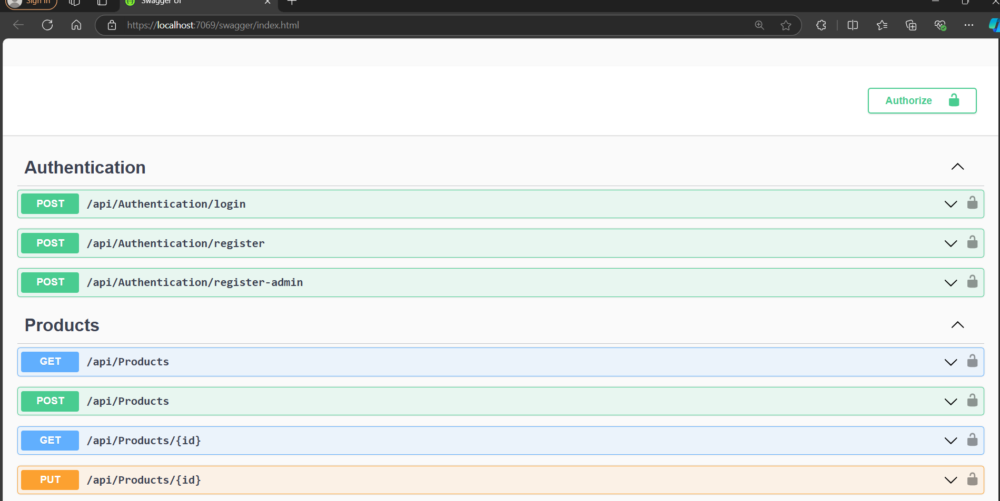
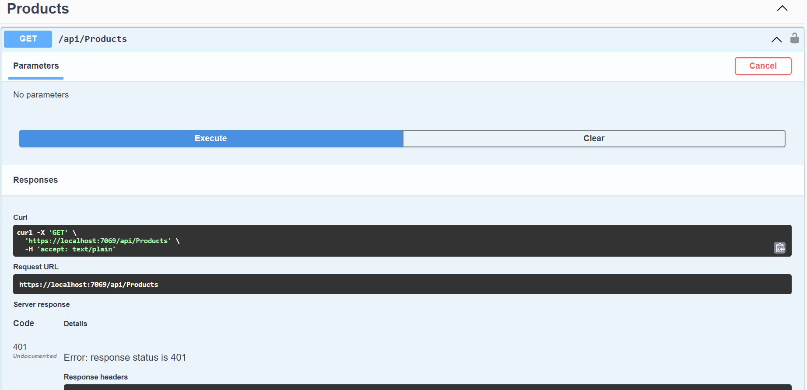
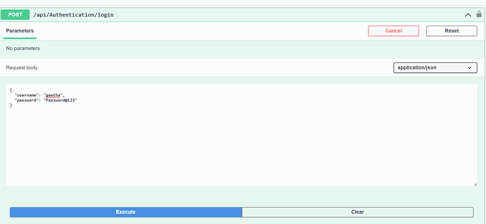
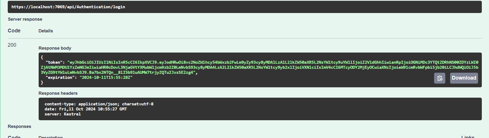
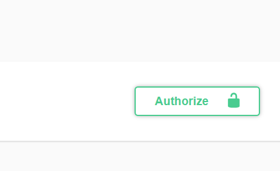
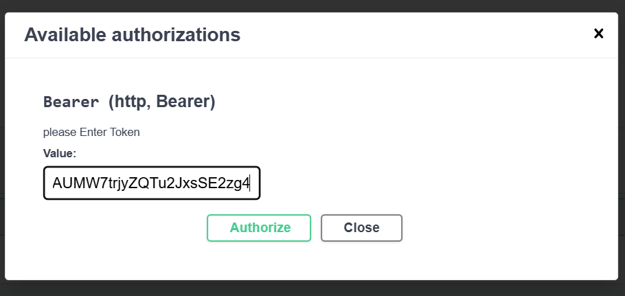

# authentication in web api Demo
1. create a new project (Training_Auth_Demo)

2. # Packages needs to install
 `Microsoft.AspNetCore.Authentication.JwtBearer`
   
 `Microsoft.AspNetCore.Identity.EntityFrameworkCore`

 `Microsoft.EntityFrameworkCore.Tools`

 `Microsoft.EntityFrameworkCore.SqlServer`

3.create an Authentication Folder

    a) add new class (ApplicationUser)

 ```cs
    using Microsoft.AspNetCore.Identity;

    namespace Training_Auth_Demo.Authentication
    {
        public class ApplicationUser:IdentityUser
        {
        }
    }

 ```
    b) add another class in authentication Folder (LoginModel)
```cs
        using System.ComponentModel.DataAnnotations;

        namespace Training_Auth_Demo.Authentication
        {
            public class LoginModel
            {
                [Required(ErrorMessage = "User Name is required")]
                public string Username { get; set; }

                [Required(ErrorMessage = "Password is required")]
                public string Password { get; set; }
            }
        }

```
    c) Add another class in authentication folder (RegisterModel)
```cs
    using System.ComponentModel.DataAnnotations;

        namespace JWT_Auth_Demo.Authentication
        {
            public class RegisterModel
            {
                [Required(ErrorMessage = "User Name is required")]
                public string Username { get; set; }

                [EmailAddress]
                [Required(ErrorMessage = "Email is required")]
                public string Email { get; set; }

                [Required(ErrorMessage = "Password is required")]
                public string Password { get; set; }
                [Required(ErrorMessage = "Role is required")]
                public string Role { get; set; }
            }
        }
```

    d) Add another class in authentication folder (UserRoles)
```cs
            public static class UserRoles
        {
            public const string Admin = "Admin";
            public const string User = "User";
        }
    ```

    e) Add another class in authentication folder (Response)
```cs
        namespace Training_Auth_Demo.Authentication
        {
            public class Response
            {
                public string Status { get; set; }
                public string Message { get; set; }
            }
        }

```

f) Add another class in authentication folder ApplicationDbContext
 ```cs
    using Microsoft.AspNetCore.Identity.EntityFrameworkCore;
    using Microsoft.EntityFrameworkCore;

    namespace Training_Auth_Demo.Authentication
    {
        public class ApplicationDbContext:IdentityDbContext<ApplicationUser>
        {
            public ApplicationDbContext(DbContextOptions<ApplicationDbContext> options) :
                base(options) { }
        }
    }

 ```
# appsettings.json
```json
        {
        "Logging": {
            "LogLevel": {
            "Default": "Information",
            "Microsoft.AspNetCore": "Warning"
            }
        },
        "AllowedHosts": "*",
        "Jwt": {
            "Key": "MySuperSecretKey12345Algorithms",
            "Issuer": "yourdomain.com",
            "Audience": "yourdomain.com"
        },
        "ConnectionStrings": {
            "DefaultConnection": "Server=(localdb)\\MSSQLLocalDB;Database=trg_Auth_DB_TestYantra;Trusted_Connection=true;TrustServerCertificate=true;"
        }
}

```

# Program.cs
```cs
using JWT_Auth_Demo.Authentication;
using JWT_Auth_Demo.Models;
using Microsoft.AspNetCore.Authentication.JwtBearer;
using Microsoft.AspNetCore.Identity;
using Microsoft.EntityFrameworkCore;
using Microsoft.Extensions.Configuration;
using Microsoft.IdentityModel.Tokens;
using System.Text;

var builder = WebApplication.CreateBuilder(args);

// Add services to the container.
{
    builder.Services.AddDbContext<ApplicationDbContext>(options => options.UseSqlServer(
        builder.Configuration.GetConnectionString("DefaultConnection")));
    // For Identity
  builder.Services.AddIdentity<ApplicationUser, IdentityRole>()
        .AddEntityFrameworkStores<ApplicationDbContext>()
        .AddDefaultTokenProviders();

    // Adding Authentication
    builder.Services.AddAuthentication(options =>
    {
        options.DefaultAuthenticateScheme = JwtBearerDefaults.AuthenticationScheme;
        options.DefaultChallengeScheme = JwtBearerDefaults.AuthenticationScheme;
        options.DefaultScheme = JwtBearerDefaults.AuthenticationScheme;
    })

    // Adding Jwt Bearer
    .AddJwtBearer(options =>
    {
        options.SaveToken = true;
        options.RequireHttpsMetadata = false;
        options.TokenValidationParameters = new TokenValidationParameters()
        {
            ValidateIssuer = true,
            ValidateAudience = true,
            ValidAudience = builder.Configuration["JWT:Audience"],
            ValidIssuer = builder.Configuration["JWT:Issuer"],
            IssuerSigningKey = new SymmetricSecurityKey
            (Encoding.UTF8.GetBytes(builder.Configuration["JWT:Key"]))
        };
    });


builder.Services.AddControllers();
          // Learn more about configuring Swagger/OpenAPI at https://aka.ms/aspnetcore/swashbuckle
          builder.Services.AddEndpointsApiExplorer();
          builder.Services.AddSwaggerGen();

          var app = builder.Build();

          // Configure the HTTP request pipeline.
          if (app.Environment.IsDevelopment())
          {
              app.UseSwagger();
              app.UseSwaggerUI();
          }

          app.UseHttpsRedirection();
          app.UseAuthentication();
          app.UseAuthorization();

          app.MapControllers();

          app.Run();
      }

      
```

Build your solution


Package manager console

Add-Migration "Db creation"

update-database

# Add AuthenticationController 
```cs
using Microsoft.AspNetCore.Http;
using Microsoft.AspNetCore.Identity;
using Microsoft.AspNetCore.Mvc;
using Microsoft.IdentityModel.Tokens;
using System.IdentityModel.Tokens.Jwt;
using System.Net;
using System.Security.Claims;
using System.Text;
using Training_Auth_Demo.Authentication;

namespace Training_Auth_Demo.Controllers
{
    [Route("api/[controller]")]
    [ApiController]
    public class AuthenticationController : ControllerBase
    {
        private readonly UserManager<ApplicationUser> userManager;
        private readonly RoleManager<IdentityRole> roleManager;
        private readonly IConfiguration _configuration;
        public AuthenticationController(UserManager<ApplicationUser> userManager,
            RoleManager<IdentityRole> roleManager,IConfiguration configuration)
        {
            this.userManager = userManager;
            this.roleManager = roleManager;
            _configuration = configuration;
        }

        [HttpPost]
        [Route("login")]
        public async Task<IActionResult> Login([FromBody] LoginModel model)
        {
            var user= await userManager.FindByNameAsync(model.Username);
            if (user !=null && await userManager.CheckPasswordAsync(user,model.Password))
            {
            var userRoles=await userManager.GetRolesAsync(user);
                var authClaims = new List<Claim>
                {  new Claim(ClaimTypes.Name,user.UserName),
                new Claim(JwtRegisteredClaimNames.Jti,Guid.NewGuid().ToString())                
                };
                foreach (var userRole in userRoles)
                {
                    authClaims.Add(new Claim(ClaimTypes.Role, userRole));
                }

                var authSigninKey = new SymmetricSecurityKey(
                    Encoding.UTF8.GetBytes(_configuration["Jwt:Key"]));
                var token = new JwtSecurityToken(
                    issuer: _configuration["Jwt:Issuer"],
                    audience: _configuration["Jwt:Audience"],
                    expires: DateTime.Now.AddHours(5),
                    claims: authClaims,
                    signingCredentials: new SigningCredentials(authSigninKey,
                    SecurityAlgorithms.HmacSha256)
                    );

                return Ok(new
                {
                    token = new JwtSecurityTokenHandler().WriteToken(token),
                    expiration = token.ValidTo
                });
            }
            return Unauthorized();
        }
        [HttpPost("register")]
        public async Task<IActionResult> Register(RegisterModel model)
        {
            var userExist = await userManager.FindByNameAsync(model.Username);
            if (userExist!=null)
            {
                return StatusCode(StatusCodes.Status500InternalServerError,new Response
                {
                    Status="Error",
                    Message="User already Exist!"
                });
            }

            ApplicationUser user = new ApplicationUser()
            { 
            Email = model.Email,
            SecurityStamp=Guid.NewGuid().ToString(),
            UserName=model.Username

            };

            var result =await userManager.CreateAsync(user,model.Password);
            if(!result.Succeeded)
            {
                return StatusCode(StatusCodes.Status500InternalServerError,
                    new Response
                    {
                        Status = "Error",
                        Message = " User Creation Failed! Pleas check the user details and try again"
                    });
            }
            if (model.Role == "user")
            {
                if (!await roleManager.RoleExistsAsync(UserRoles.User))
                {
                    await roleManager.CreateAsync(new IdentityRole(UserRoles.User));
                }
                if (await roleManager.RoleExistsAsync(UserRoles.User))
                    await userManager.AddToRoleAsync(user,UserRoles.User);
                
            }
            if (model.Role == "admin")
            {
                if (!await roleManager.RoleExistsAsync(UserRoles.Admin))
                {
                    await roleManager.CreateAsync(new IdentityRole(UserRoles.Admin));
                }
                if (!await roleManager.RoleExistsAsync(UserRoles.Admin))

                    await userManager.AddToRoleAsync(user, UserRoles.User);
                
            }
            return Ok(new Response { Status = "Success", Message = "User Created Successfully" });
        }
    }
    }


```
# To Enable the Authorize icon in Swagger
# progrm.cs
```cs


builder.Services.AddSwaggerGen(c =>
{
    c.SwaggerDoc("v1", new OpenApiInfo { Title = "My API", Version = "v1" });
    c.AddSecurityDefinition("Bearer", new OpenApiSecurityScheme
    {
        In = ParameterLocation.Header,
        Description = "please Enter Token",
        Name = "Authorization",
        Type = SecuritySchemeType.Http,
        BearerFormat = "JWT",
        Scheme = "bearer"
    });
    c.AddSecurityRequirement(new OpenApiSecurityRequirement
        {
            {
                new OpenApiSecurityScheme
                {
                    Reference = new OpenApiReference
                    {
                        Type = ReferenceType.SecurityScheme,
                        Id = "Bearer"
                    }
                },
                new string[] { }
            }
        });
});
```

# let us connect with BikeStores db in the same wb api project
todo so let us use Db-First-Approach

goto package Manager console
`Scaffold-DbContext "Server=(localdb)\MSSQLLocalDB;Database=BikeStores;Trusted_Connection=True;TrustServerCertificate=True" Microsoft.EntityFrameworkCore.SqlServer -OutputDir Models`

It will create Models Folder ==> add all classes related to Entities.
(BikeStoreContext communicate with server)


Register that in program.cs
```cs
builder.Services.AddDbContext<BikeStoresContext>(); // as it has server details you can use it 
 (or)
 builder.Services.AddDbContext<ApplicationDbContext>(options => options.UseSqlServer(
        builder.Configuration.GetConnectionString("BikeStoreConnection"))); // if you registered in appsettings.json file as bikeStoreConnection you can go with this option
```


# Create Products Controller (or) any other controller depends on your Requirement

# ProductsController.cs
```cs

using System;
using System.Collections.Generic;
using System.Linq;
using System.Threading.Tasks;
using Microsoft.AspNetCore.Authorization;
using Microsoft.AspNetCore.Authorization.Infrastructure;
using Microsoft.AspNetCore.Http;
using Microsoft.AspNetCore.Mvc;
using Microsoft.EntityFrameworkCore;
using Training_Auth_Demo.Models;

namespace Training_Auth_Demo.Controllers
{
  //  [AllowAnonymous]
    [Route("api/[controller]")]
    [ApiController]
    public class ProductsController : ControllerBase
    {
        private readonly BikeStoresContext _context;

        public ProductsController(BikeStoresContext context)
        {
            _context = context;
        }
        [Authorize(Roles = "User")]
        // GET: api/Products
        [HttpGet]
        public async Task<ActionResult<IEnumerable<Product>>> GetProducts()
        {
            return await _context.Products.ToListAsync();
        }

        // GET: api/Products/5
        [HttpGet("{id}")]
        public async Task<ActionResult<Product>> GetProduct(int id)
        {
            var product = await _context.Products.FindAsync(id);

            if (product == null)
            {
                return NotFound();
            }

            return product;
        }

        // PUT: api/Products/5
        [HttpPut("{id}")]
        public async Task<IActionResult> PutProduct(int id, Product product)
        {
            if (id != product.ProductId)
            {
                return BadRequest();
            }

            _context.Entry(product).State = EntityState.Modified;

            try
            {
                await _context.SaveChangesAsync();
            }
            catch (DbUpdateConcurrencyException)
            {
                if (!ProductExists(id))
                {
                    return NotFound();
                }
                else
                {
                    throw;
                }
            }

            return NoContent();
        }

        // POST: api/Products    
        [Authorize(Roles ="Admin")]
        [HttpPost]

        public async Task<ActionResult<Product>> PostProduct(Product product)
        {
            _context.Products.Add(product);
            try
            {
                await _context.SaveChangesAsync();
            }
            catch (DbUpdateException)
            {
                if (ProductExists(product.ProductId))
                {
                    return Conflict();
                }
                else
                {
                    throw;
                }
            }

            return CreatedAtAction("GetProduct", new { id = product.ProductId }, product);
        }

        // DELETE: api/Products/5
        [HttpDelete("{id}")]
        public async Task<IActionResult> DeleteProduct(int id)
        {
            var product = await _context.Products.FindAsync(id);
            if (product == null)
            {
                return NotFound();
            }

            _context.Products.Remove(product);
            await _context.SaveChangesAsync();

            return NoContent();
        }

        private bool ProductExists(int id)
        {
            return _context.Products.Any(e => e.ProductId == id);
        }
    }
}

````

Then  run your app.


goto GetProducts Endpint without login ypu will ger an Unauthorized Error as you have not
passed valid token



so login with proper credentials and receive the token





after you gave token .Now goto access getproducts endpoint.


Login as Admin and receive token ==> Request for POST product Endpoint can accessible by 
Admin


Below is the link to get code
https://github.com/geethasamynathan/JWT_Auth_Demo_TestYantra