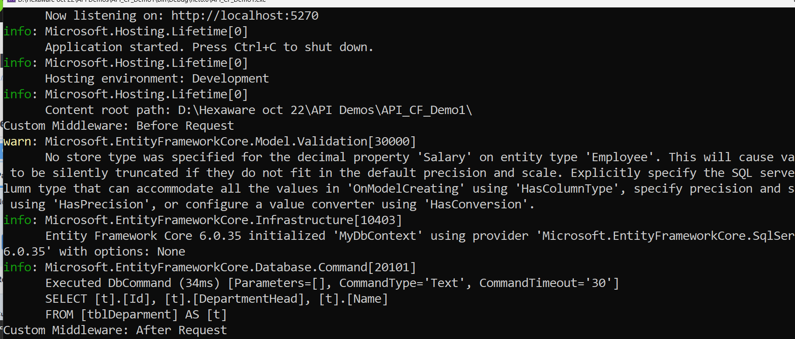

# What is Custom Middleware?
In ASP.NET Core, middleware is a component that is part of the request-response pipeline. It can inspect, modify, or process HTTP requests and responses. Middleware components are typically used to perform tasks such as logging, authentication, authorization, exception handling, request modification, or response modification.

Custom middleware refers to any middleware that you create to handle specific tasks that are not provided by default in the framework. You can define custom middleware by writing a class that implements the middleware logic, or by using a delegate to handle the request.

# Structure of Custom Middleware
A custom middleware in ASP.NET Core typically consists of a class with an Invoke or InvokeAsync method. It follows a pattern of accepting an HttpContext and calling the next middleware in the pipeline.
```cs
public class CustomMiddleware
{
    private readonly RequestDelegate _next;

    public CustomMiddleware(RequestDelegate next)
    {
        _next = next;
    }

    public async Task InvokeAsync(HttpContext context)
    {
        // Logic before passing the request to the next middleware
        Console.WriteLine("Before the request is handled by the next middleware.");

        // Call the next middleware in the pipeline
        await _next(context);

        // Logic after the next middleware has processed the request
        Console.WriteLine("After the request is handled by the next middleware.");
    }
}
``` 

# How to Register Custom Middleware?
In ASP.NET Core, middleware is added to the pipeline during the application startup phase. You register middleware in the Configure method of the Startup class (or in Program.cs in newer versions of ASP.NET Core like 6.0).

In .NET 6, middleware registration is typically done in Program.cs:
```cs
var builder = WebApplication.CreateBuilder(args);
var app = builder.Build();

// Register custom middleware
app.UseMiddleware<CustomMiddleware>();

app.MapGet("/", () => "Hello World!");

app.Run();
```

# use middleware directly using a lambda expression:
```cs
app.Use(async (context, next) =>
{
    Console.WriteLine("Custom Middleware: Before");
    await next();
    Console.WriteLine("Custom Middleware: After");
});

```

# What is the Use of Custom Middleware?
Custom middleware can be used to handle a variety of tasks in your application, such as:

**Logging:** Track incoming requests, outgoing responses, and exceptions.
Request and Response Modification: Modify request headers, body, or response content.
**Authentication and Authorization:** Perform custom user authentication and authorization checks.
**Performance Monitoring:** Track request latency or execution time for specific endpoints.
**Exception Handling:** Handle exceptions globally in one place without writing try-catch blocks in each controller action.
**Caching:** Implement custom caching logic for responses.
**Cross-cutting concerns:** Manage things that affect multiple parts of the system, like rate-limiting or input validation.

# When to Use Custom Middleware in ASP.NET Core Web API 6.0?
Custom middleware is useful when you need to perform certain operations globally, before or after the request reaches your controllers. Here are some scenarios where you might want to use custom middleware:

**Logging and Monitoring:**

Log request details (headers, body, etc.).
Track the time it takes to process requests.

**Cross-Cutting Concerns:**

Handle authorization, authentication, and roles across all endpoints.
Implement custom CORS (Cross-Origin Resource Sharing) rules.

**Request Validation:**

Validate headers, query parameters, or body content before it reaches the controller.

**Exception Handling:**

Use custom middleware to globally catch and handle exceptions in the request pipeline.

**Caching:**

Implement custom caching mechanisms for responses (e.g., store results of expensive database queries in memory).

# summary 
Custom middleware is a powerful feature in ASP.NET Core, allowing developers to insert custom behavior into the HTTP request pipeline. It can be used to handle cross-cutting concerns, modify requests and responses, and perform tasks such as logging, exception handling, or caching globally across the application.

# Steps to perform Custom Middleware

**Step 1:** Create a New ASP.NET Core Web API Project
Open Visual Studio 2022.

Go to File > New > Project.

Choose ASP.NET Core Web API and click Next.

Name your project, choose a location, and click Create.

Select .NET 6.0 (Long-term support) and click Create.

**Step 2: Create Custom Middleware**
Add a Middleware Class:

Right-click on the project, select Add > New Folder, and name it Middleware.

Right-click on the Middleware folder, select Add > Class, and name it `CustomMiddleware.cs`.

Implement the Middleware:
```cs

using Microsoft.AspNetCore.Http;
using System.Threading.Tasks;

public class CustomMiddleware
{
    private readonly RequestDelegate _next;

    public CustomMiddleware(RequestDelegate next)
    {
        _next = next;
    }

    public async Task InvokeAsync(HttpContext context)
    {
        // Custom logic before calling the next middleware
        Console.WriteLine("Custom Middleware: Before Request");

        // Call the next middleware in the pipeline
        await _next(context);

        // Custom logic after calling the next middleware
        Console.WriteLine("Custom Middleware: After Request");
    }
}
```
**Step 3: Register the Middleware**
**Create an Extension Method:**

Right-click on the Middleware folder, select Add > Class, and name it `CustomMiddlewareExtensions.cs`.
```cs
using Microsoft.AspNetCore.Builder;

public static class CustomMiddlewareExtensions
{
    public static IApplicationBuilder UseCustomMiddleware(this IApplicationBuilder builder)
    {
        return builder.UseMiddleware<CustomMiddleware>();
    }
}```

# Program.cs
```cs
var builder = WebApplication.CreateBuilder(args);
var app = builder.Build();

// Use the custom middleware
app.UseCustomMiddleware();

app.UseHttpsRedirection();
app.UseAuthorization();
app.MapControllers();

app.Run();

```

# Middleware Class:

The CustomMiddleware class has a constructor that accepts a RequestDelegate and an InvokeAsync method. The InvokeAsync method contains the logic that will execute when the middleware is called.

Before and after calling _next(context), you can add any custom logic you want to execute during the request processing.

# Extension Method:

The UseCustomMiddleware extension method makes it easy to add your middleware to the pipeline using the app.UseCustomMiddleware() call in Program.cs.

# Registration in Program.cs:

Register the middleware using app.UseCustomMiddleware(). This ensures that the middleware is part of the request processing pipeline.

# Testing Your Middleware
Run your application by pressing F5 or clicking the green "Start" button.

Make a request to any endpoint in your Web API.

Check the console output to see the custom messages logged by the middleware.



# Custom exception handling using custom middleware
Create Custom Exception Handling Middleware
**Add a Middleware Class:**

Right-click on the project, select Add > New Folder, and name it Middleware.

Right-click on the Middleware folder, select Add > Class, and name it `ExceptionHandlingMiddleware.cs`.

# Implement the Middleware:
```cs
using Microsoft.AspNetCore.Http;
using System;
using System.Net;
using System.Threading.Tasks;
using Microsoft.Extensions.Logging;

public class ExceptionHandlingMiddleware
{
    private readonly RequestDelegate _next;
    private readonly ILogger<ExceptionHandlingMiddleware> _logger;

    public ExceptionHandlingMiddleware(RequestDelegate next, ILogger<ExceptionHandlingMiddleware> logger)
    {
        _next = next;
        _logger = logger;
    }

    public async Task InvokeAsync(HttpContext context)
    {
        try
        {
            await _next(context);
        }
        catch (Exception ex)
        {
            _logger.LogError(ex, "An unhandled exception has occurred.");
            await HandleExceptionAsync(context, ex);
        }
    }

    private static Task HandleExceptionAsync(HttpContext context, Exception exception)
    {
        context.Response.ContentType = "application/json";
        context.Response.StatusCode = (int)HttpStatusCode.InternalServerError;

        var result = new
        {
            StatusCode = context.Response.StatusCode,
            Message = "An unexpected error occurred. Please try again later.",
            Detailed = exception.Message
        };

        return context.Response.WriteAsJsonAsync(result);
    }
}
```

# Register the Middleware
**Create an Extension Method:**

Right-click on the Middleware folder, select Add > Class, and name it `ExceptionHandlingMiddlewareExtensions.cs`.