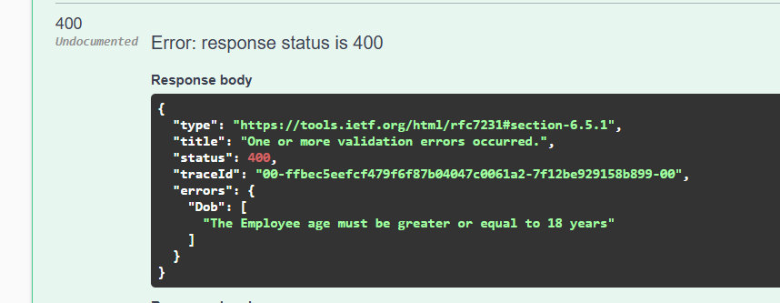
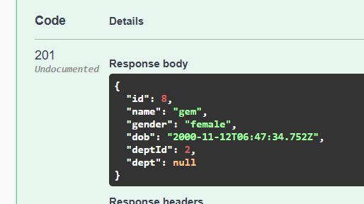

# Custom Validation

create a class Employee in the models or you can use any existing model as well
```cs
 public partial class Employee
 {
     public int Id { get; set; }
     public string? Name { get; set; }
     public string? Gender { get; set; }
   //  [EmployeeDateOfBirthValidation]
     public DateTime? Dob { get; set; }
     public int? DeptId { get; set; }

     public virtual Department? Dept { get; set; }
 }
```


Add Folder > Validations > Add Class `EmployeeDateOfBirthValidation.cs`
```cs 
using System.ComponentModel.DataAnnotations;

namespace EF_Raw_SQL_Demo.Validations
{
    public class EmployeeDateOfBirthValidation: ValidationAttribute
    {
        public const string MINIMUM_DATE_OF_BIRTH =
        "The Employee age must be greater or equal to 18 years";
        private int MINIMUM_AGE = 18;

        protected override ValidationResult? IsValid(object? value, ValidationContext validationContext)
        {
            var valueString = value != null ? value.ToString() : null;

            // If value is empty, show Success
            if (string.IsNullOrWhiteSpace(valueString))
            {
                return ValidationResult.Success;
            }

            // If dob cannot be parsed in Date then it is invalid
            if (!DateTime.TryParse(valueString, out DateTime dob))
            {
                return new ValidationResult("Please provide the date of birth in a valid format");
            }

            // Check if the age is under the minimum age. finding the calendar date of 18 years ago
            var minDateOfBirth = DateTime.Now.Date.AddYears(MINIMUM_AGE * -1);

            if (dob > minDateOfBirth)
            {
                return new ValidationResult(MINIMUM_DATE_OF_BIRTH);
            }

            return ValidationResult.Success;
        }
    }
}
```

Then goto `Employee.cs` class
Add CustomValidationAttribute to DOB property

`  [EmployeeDateOfBirthValidation]
 public DateTime? Dob { get; set; }
`

Run the App.

{
  "id": 7,
  "name": "gem",
  "gender": "female",
  "dob": "2015-11-12T06:47:34.752Z",
  "deptId": 2
  
}




{
  "id": 8,
  "name": "gem",
  "gender": "female",
  "dob": "2000-11-12T06:47:34.752Z",
  "deptId": 2
  
}



