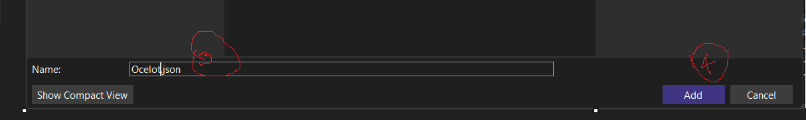
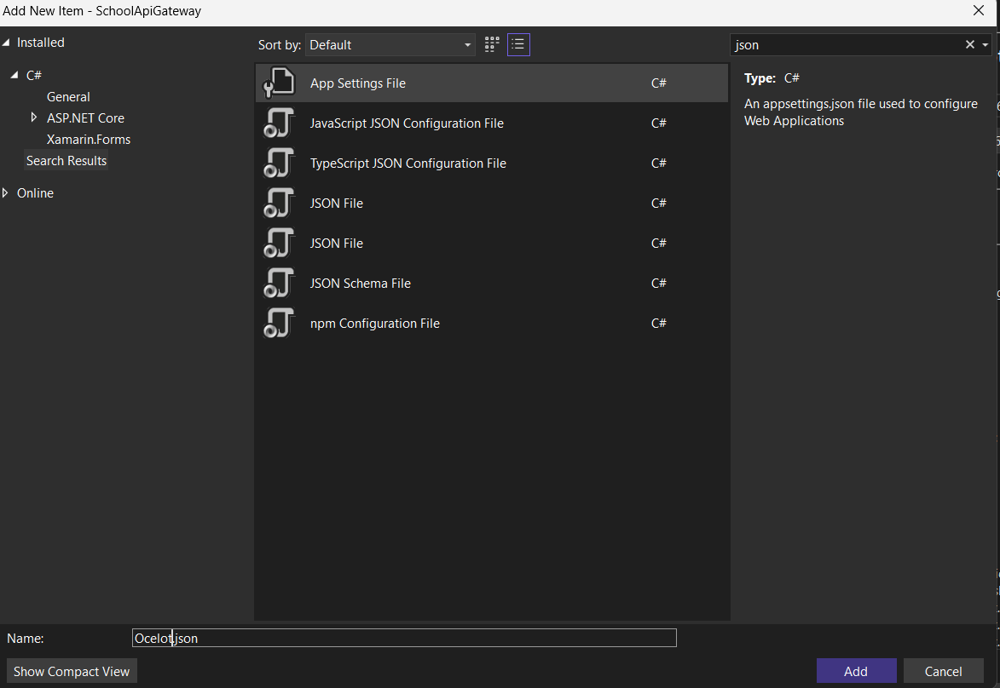

Open vs2022
create a blank solution


Now StudentAttendance web api project created . same way we will create one more api for SchoolAdmission web api also


Next we are going to create apigateway (web api Project)


Goto SchoolAdmission web api project ==> let us implements the functionality

Add new Folder (models)
# Add new Class StudentAdmissionDetailModel

```cs
namespace SchoolAdmission.Models
{
    public class StudentAdmissionDetailModel
    {
        public int StudentID { get; set; }
        public string StudentName { get; set; }
        public string StudentClass { get; set;}
        public DateTime DateofJoining { get; set; }
    }
    
}

```

Right click on Controllers folder in  SchoolAdmission ==> 
# Add new  API Controller 


name it as SchoolAdmissionController
```cs
using Microsoft.AspNetCore.Http;
using Microsoft.AspNetCore.Mvc;
using SchoolAdmission.Models;

namespace SchoolAdmission.Controllers
{
    [Route("api/[controller]")]
    [ApiController]
    
    public class SchoolAdmissionController : ControllerBase
    {
        static List<StudentAdmissionDetailModel> studentAdmissionList=new List<StudentAdmissionDetailModel>();

        [HttpGet]
        public async Task<List<StudentAdmissionDetailModel>> Get()
        {
            StudentAdmissionDetailModel admission1 = new StudentAdmissionDetailModel();
            StudentAdmissionDetailModel admission2 = new StudentAdmissionDetailModel();
            StudentAdmissionDetailModel admission3 = new StudentAdmissionDetailModel();

            admission1.StudentID = 101;
            admission1.StudentName = "Varsha JK";
            admission1.StudentClass = ".NET FSD";
            admission1.DateofJoining = DateTime.Now;
            admission2.StudentID = 102;
            admission2.StudentName = "Tarun S";
            admission2.StudentClass = ".NET FSD";
            admission2.DateofJoining = DateTime.Now;
            admission3.StudentID = 103;
            admission3.StudentName = "Prateek";
            admission3.StudentClass = ".NET FSD";
            admission3.DateofJoining = DateTime.Now;

           
            studentAdmissionList.Add(admission1);
            studentAdmissionList.Add(admission2);
            studentAdmissionList.Add(admission3);
            return studentAdmissionList;
        }

        
    }
}
```
make sure SchoolAdmission project is start up project
Run the application and test whether is it return all values correctly or not


============================================================================
Next lets implement the functionality for StudentAttendance project
Right click on StudentAttendance project ==>Add Models folder

# Add new Class StuAttendance

```cs
namespace StudentAttendance.Models
{
    public class StuAttendance
    {
        public int StudentID { get; set; }
        public string StudentName { get; set; }
        public double AttendancePercentage { get;set; }
    }
}


```

# Add new Controller StudentsAtendanceController

```cs
using Microsoft.AspNetCore.Http;
using Microsoft.AspNetCore.Mvc;
using StudentAttendance.Models;

namespace StudentAttendance.Controllers
{
    [Route("api/[controller]")]
    [ApiController]
    public class StudentsAtendanceController : ControllerBase
    {
        static List<StuAttendance> attendanceList;
        [HttpGet]
        public List<StuAttendance> Get()
        {
          attendanceList=new List<StuAttendance> {
               new StuAttendance() { StudentID=101,StudentName="Varsha JK", AttendancePercentage=90},
                new StuAttendance() { StudentID=102,StudentName="Tarun", AttendancePercentage=91},
                new StuAttendance() { StudentID=103,StudentName="Manan", AttendancePercentage=92},
                new StuAttendance() { StudentID=104,StudentName="Tejas", AttendancePercentage=93},

          };
            return attendanceList;
        }

    }
}

```


Now make Studentattendance project also as a start up project ==> Right click on any Project in the solution 
Configure project==> 


Now run the project
schooladmission project runs in 7135 port

SchoolAttendance running in 7076 (it vary )


now we confirmed both the api working fine independently


next lets implement the apiGateway


we need to install ocelot package from nuget package solution==>
Right click SchoolApiGateway Project  ==> Nuget packages for solution


right click on SchoolAPI Gateway ==>Add New Item==>Ocelot.json






```json
{
  "GlobalConfiguration": {
    "BaseUrl": "http://localhost:5003"
  },
  "Routes": [
    {
      "UpstreamPathTemplate": "/apigateway/Attendance",
      "UpstreamHttpMethod": [ "GET" ],
      "DownstreamPathTemplate": "/api/StudentsAtendance",
      "DownstreamScheme": "https",
      "DownstreamHostAndPorts": [
        {
          "Host": "localhost",
          "Port": 7076
        }
      ]
    },
    {
      "UpstreamPathTemplate": "/apigateway/Admission",
      "UpstreamHttpMethod": [ "GET" ],
      "DownstreamPathTemplate": "/api/SchoolAdmission",
      "DownstreamScheme": "https",
      "DownstreamHostAndPorts": [
        {
          "Host": "localhost",
          "Port": 7135
        }
      ]
    }
  ]
}
```

Goto program.cs of schoolapigateway project

```cs
using Ocelot.DependencyInjection;
using Ocelot.Middleware;

var builder = WebApplication.CreateBuilder(args);

// Add services to the container.

builder.Services.AddControllers();
//builder.Services.AddOcelot();
builder.Configuration.AddJsonFile("Ocelot.json", optional: false, reloadOnChange: true);
builder.Services.AddOcelot(builder.Configuration);
// Learn more about configuring Swagger/OpenAPI at https://aka.ms/aspnetcore/swashbuckle
builder.Services.AddEndpointsApiExplorer();
builder.Services.AddSwaggerGen();
var app = builder.Build();
// Configure the HTTP request pipeline.
if (app.Environment.IsDevelopment())
{
    app.UseSwagger();
    app.UseSwaggerUI();
}
app.UseHttpsRedirection();
app.UseAuthorization();
app.MapControllers();

await app.UseOcelot();

app.Run();

```


Now make all project as startup project


If you do not want launch admission and attendace api in swagger 
Both  the Project Launchsetting .json  comment the 
// "launchUrl": "swagger",

And Run


